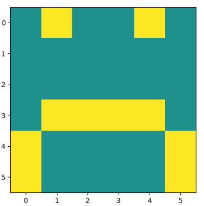
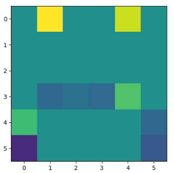
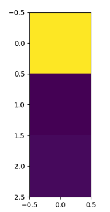

# MachineLearningStudy

100 iterations

Map | 300x300 | 600x600 | 900x900|
--- | --- | --- | --- |
BFS time| 0.164265 | 0.765614 | 1.775312 |
BFS steps | 555 | 1248 | 1844 |
Greedy time | 0.054751 | 0.210057 | 0.450618
Greedy steps | 867 | 2420 | 3436 |
A* time | 0.216741 | 1.190275 | 6.154340 |
A* steps | 555 | 1248 | 1844 |

NQueen
Solutions for board NxN:
N = 4

[0, 0, 1, 0]  
 [1, 0, 0, 0]  
[0, 0, 0, 1]  
[0, 1, 0, 0]  

N = 5

[0, 0, 1, 0, 0]  
[0, 0, 0, 0, 1]  
[0, 1, 0, 0, 0]  
[0, 0, 0, 1, 0]  
[1, 0, 0, 0, 0]  

N = 6

[1, 0, 0, 0, 0, 0]  
[0, 0, 0, 0, 1, 0]  
[0, 0, 1, 0, 0, 0]  
[0, 0, 0, 0, 0, 1]  
[0, 0, 0, 1, 0, 0]  
[0, 1, 0, 0, 0, 0]   

N = 7

[0, 0, 0, 0, 1, 0, 0]  
[1, 0, 0, 0, 0, 0, 0]  
[0, 0, 0, 0, 0, 1, 0]  
[0, 0, 0, 1, 0, 0, 0]  
[0, 1, 0, 0, 0, 0, 0]  
[0, 0, 0, 0, 0, 0, 1]  
[0, 0, 1, 0, 0, 0, 0]  

N = 8

[0, 0, 0, 0, 1, 0, 0, 0]  
[0, 1, 0, 0, 0, 0, 0, 0]  
[0, 0, 0, 1, 0, 0, 0, 0]  
[0, 0, 0, 0, 0, 0, 1, 0]  
[0, 0, 1, 0, 0, 0, 0, 0]  
[0, 0, 0, 0, 0, 0, 0, 1]  
[0, 0, 0, 0, 0, 1, 0, 0]  
[1, 0, 0, 0, 0, 0, 0, 0]  

NQPosition

I have learned how hill climbing works.
It finds local maximum, so we need to restart simulation
with different position randomly. 

ResolutionMethod

First Problem

Kb: [['-p', 'q'], ['-l', '-m', 'p'], ['-b', '-l', 'm'], ['-a', '-p', 'l'], ['-a', '-b', 'l'], ['b'], ['a']]

and Neg Alpha: -q

Returns True

Second Problem

KB: ['-outside_power', 'w5'], ['outside_power', '-w5'], ['-w5', '-cb1', 'w3'], ['-w3', '-cb1', 'w5'],
                     ['-w5', '-cb2', 'w6'], ['-w6', 'p2'], ['-w3', 'p1'], ['-w3', 's1', 'w2'], ['-w3', '-s1', 'w1'],
                     ['s1', '-w1'], ['-s1', '-w2'], ['-w2', 's2', 'w0'], ['-w1', '-s2', 'w0'], ['w2', 's2', '-w0'],
                     ['w1', '-s2', '-w0'], ['-w0', 'l1'], ['w0', '-l1'], ['-w4', 'l2'], ['-l1', 'w0'], ['w3', '-cb1'],
                     ['-w3', '-s3', 'w4'], ['-l2', 'w4'], ['s3', '-w4']

1. question KB += [['outside_power'], ['cb2']], ['-p2']

neg alpha = '-p2' 
returns True

2. question KB += [['outside_power'], ['cb1'], ['-s1'], ['s2']]

neg alpha = 'l1' 
never returns anything

3. question KB += [['outside_power'], ['-l1'], ['s1'], ['s2']]

neg alpha = 'cb1' 
returns False

NaiveBayes

From 100 tests, 96 are correct and 4 are giving error. Finishing in, approximately, 0.095 seconds.

NeuralNetwork

Sad picture.
original - 
first weight of 1st layer - 
first wieght of 2nd layer - 
